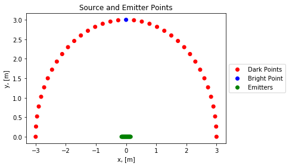

# PyBeam
[](https://www.python.org/downloads/release/python-360/)
[](https://opensource.org/licenses/MIT)
[](https://smtm1209.github.io/PyBeam-Documentation/pybeam.html)

The library which implements all the routines necessary for loudspeaker beamforming on a computer. 

## Getting Started

#### Physical Requirements:

To run and playback processed signals, the minimum you need is a laptop and some standalone speakers. However, to really experience beamforming you need a beamforming array and way to physically output to more than just one audio channel simultaneously. It is recomended to use something like [this](https://www.amazon.com/gp/product/B010L4IXUS/ref=oh_aui_detailpage_o06_s00?ie=UTF8&psc=1) paired with a USB hub to drive a large amount of speakers. 

#### Software Requirements:

You need some version of Python 3 to use PyBeam, preferably Python 3.6 or higher. Moreover, PyBeam also has a dependancy on some Python libraries found [here](requirements.txt). 

To install PyBeam, you can run the following commands:

```
$ git clone https://github.com/smtm1209/PyBeam.git
$ pip install -r ./PyBeam/requirements.txt
```

Until PyBeam becomes a proper module, add these lines towards the top of any file that need to use PyBeam's routines. 

```python
import sys
import os
sys.path.insert(0, os.path.abspath('path/to/PyBeam/'))
import pybeam
```

#### Initializing Your Loudspeaker Array

Initialization entails creating a speaker mapping. This process entails identifying which PyAudio output stream index corresponds to which physical speaker pair in your beamforming array. A sample routine designed around the speakers mentioned above is [here](https://github.com/smtm1209/PyBeam-Raw/blob/master/mapGen.py). In order to gain insight into the streams present on your computer, consider looking at [this](https://github.com/smtm1209/PyBeam-Raw/blob/master/pyaudioinfo.py) simple script. 

## Signal Processing

#### Data Structure Initialization

The first step in processing an audio signal is to initialize a source point matrix and a verification point matrix, following the scheme below as an example. 



In this diagram, there are 16 source points centered at the origin in a line parallel to the x-axis. The sources are space out at a distance of two centimeters. There are also 37 verification points, all at a radius of 3 meters from the origin, with five degrees between each point. The point in the very center is the _bright point_, or the point where the signal will be beamformed to. The code generate this scheme is here.

```python
# source matrix creation
Y = pybeam.get_source_matrix(dim=(16, 1), delta=(0.02, 0))

# verification matrix creation
X = pybeam.get_verification_matrix(R=3, dim=(37, 1), b=(90, 90))
```

#### Reading the Signal

The next step is to load the `.wav` file that we want to process. The code to do that is here.

```python
signal, samp_freq, dtype = pybeam.read_wav_file('path/to/wav/file.wav')
```

#### Filter Calculation

From here, we're able to generate the filters we will use to process the data. PyBeam has two routines for this sort of computation: `pybeam.get_DAS_filters` and `pybeam.get_PM_filters`. These two functions have the same type of output, and only really differ in the algorithm used to come to that result, delay and sum and pressure matching, respectively. Those algorithms, and the more theoretical components of this project, are detailed [here](article.pdf). 

To calculate the filters with pressure matching, you use this code. 

```python
Q = pybeam.get_PM_filters(X=X, Y=Y,
        E_max=pybeam.get_max_energy(Y=Y, sigma=25, R=3),
        p_hat=pybeam.get_target_sound_pressures(X=X, onval=1, offval=0),
        samp_freq=samp_freq, samples=1024, modeling_delay=0, verbose=False)
```

On the other hand, to calculate the filters with delay and sum, use this code.

```python
Q = pybeam.get_DAS_filters(X=X, Y=Y,
        samp_freq=samp_freq, samples=1024, modeling_delay=0)
```

#### Filter Application

The next step is to map the filters we just calculated onto the signal from the `.wav` file we read in earlier. To do this, we use the `pybeam.map_filters` function. The code to use this function is here.

```python
output = pybeam.map_filters(Q, signal)
```
#### Data Output

The final step is writing the output as a directory of `.wav` files with a mapping pickle file so that it can be played back later. This functionality is contained in the `pybeam.write_wav_dir` function. Here's some sample code for interfacing with this function. 

```python
mapping = pkl.load(open('path/to/mastermap.pkl', 'rb'))
pybeam.write_wav_dir('path/to/output_directory', output, mapping, samp_freq)i
```

#### Playback 

To playback, all you have to do is invoke the `pybeam.playback_wav_dir` function. 

```python
pybeam.playback_wav_dir('path/to/output_directory')
```


